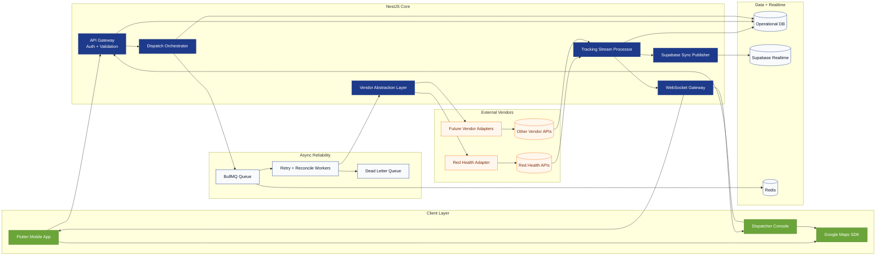
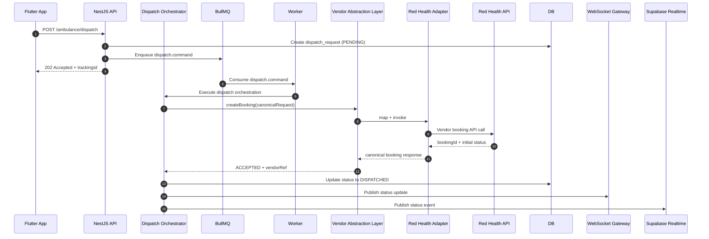
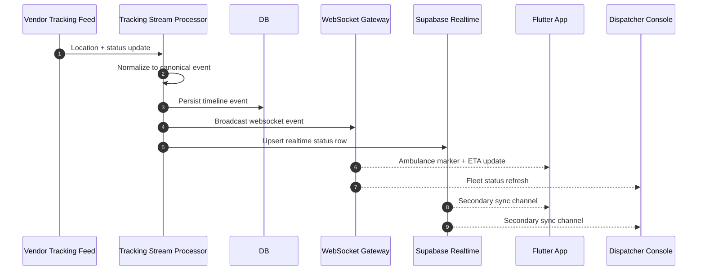
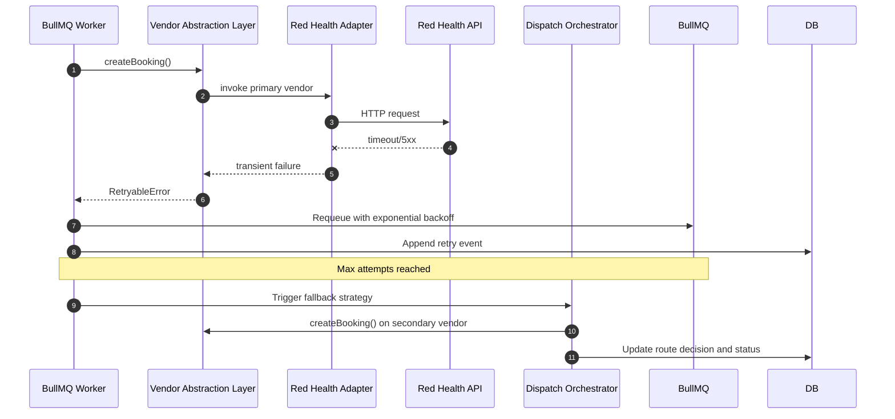

# CallHealth Ambulance Integration Platform Architecture

## 1. Requirement Analysis

### 1.1 Business Objective
Build a vendor-agnostic ambulance orchestration platform where the Flutter frontend integrates once with CallHealth APIs and can route to Red Health now or any future vendor later, without frontend changes.

### 1.2 Functional Requirements Interpreted
- One-tap ambulance dispatch from Flutter app.
- Real-time tracking on Google Maps in patient app and dispatcher console.
- Real-time status sync across channels (patient app, dispatcher, support tools).
- Vendor-specific API integration for booking, cancel, ETA, and tracking.
- Reliable retry and recovery mechanisms for transient failures.
- Low-latency live updates via WebSockets and Supabase Realtime.

### 1.3 Technology Constraints
- Backend must be NestJS.
- Mobile app is Flutter.
- Maps and route rendering via Google Maps SDK.
- Live tracking stream via WebSockets.
- Retry and background processing via BullMQ.
- Status synchronization via Supabase Realtime.

### 1.4 Quality Attribute Priorities
- Availability: dispatch and tracking should stay operational despite partial vendor outages.
- Reliability: every critical command is idempotent and retriable.
- Scalability: support multiple vendors, regions, and peak emergency traffic.
- Extensibility: add a new vendor by plugging adapter and configuration only.
- Observability: end-to-end traceability for every ambulance request.

---

## 2. High-Level System Architecture

### 2.1 Architectural Style
- Modular monolith first, event-driven inside backend.
- Clear bounded contexts in NestJS modules.
- Adapter pattern for vendor integration.
- Command-query separation for write reliability and read optimization.

### 2.2 Core Runtime Flow
1. Flutter app calls CallHealth Dispatch API.
2. Dispatch API creates a `dispatch_request` and emits command to BullMQ.
3. Orchestrator selects vendor and invokes Vendor Abstraction Layer.
4. Vendor Adapter calls external vendor APIs.
5. Status and location updates are normalized into canonical events.
6. Events fan out to:
- WebSocket Gateway for low-latency client updates.
- Supabase Realtime for cross-system synchronization.
- Persistent store for timeline/audit.

### 2.3 Logical Components
- API Gateway Module (NestJS Controllers).
- Dispatch Orchestrator Module.
- Vendor Abstraction Layer.
- Red Health Adapter Module (initial vendor).
- Tracking Ingestion and Stream Processor.
- WebSocket Gateway Module.
- Supabase Sync Publisher.
- BullMQ Job Workers (retry, reconciliation, dead-letter handling).
- Persistence Layer (transactional DB + optional cache).
- Observability Layer (logs, metrics, traces, alerts).

---

## 3. Component Diagram

---

## 4. Sequence Diagrams

## 4.1 Dispatch and Vendor Booking

## 4.2 Live Tracking and Status Sync

## 4.3 Retry, Failure, and Fallback

---

## 5. Vendor Abstraction Layer Design

### 5.1 Design Principles
- Frontend should only consume canonical CallHealth contract.
- Vendor APIs are isolated behind adapters.
- No vendor-specific field leaks into client payloads.
- Every operation supports idempotency keys.
- Capability flags drive runtime behavior.

### 5.2 Canonical Domain Model
- DispatchRequest
- DispatchQuote
- DispatchBooking
- AmbulanceStatus
- LocationEvent
- ETAEvent
- CancellationResult
- VendorError (normalized error taxonomy)

### 5.3 Adapter Contract (Conceptual)
- `createBooking(request, context)`
- `cancelBooking(bookingRef, reason, context)`
- `getBookingStatus(bookingRef, context)`
- `subscribeOrPollTracking(bookingRef, context)`
- `estimateETA(request, context)`
- `healthCheck()`

### 5.4 Capability Matrix
Each adapter declares capabilities so orchestrator can route conditionally.
- Supports webhooks.
- Supports push tracking.
- Supports cancellation after dispatch.
- Supports dynamic ETA.
- Supports ambulance class filters.

### 5.5 Routing and Selection Policy
- Primary rule: city/zone mapping.
- Secondary rule: live vendor health score.
- Tertiary rule: SLA and success-rate weighted routing.
- Emergency override: force preferred vendor from dispatcher console.

### 5.6 Error Normalization
Map vendor errors into canonical categories.
- AUTH_FAILURE
- RATE_LIMITED
- TEMPORARY_UNAVAILABLE
- INVALID_REQUEST
- BOOKING_REJECTED
- UNKNOWN

### 5.7 Idempotency and Exactly-Once Intent
- Client sends `requestId` for dispatch.
- Backend stores unique `(tenantId, requestId)`.
- Outbound vendor calls include deterministic idempotency token.
- Duplicate callbacks/events are deduplicated by `(vendor, vendorEventId)`.

### 5.8 Adding New Vendor Workflow
1. Implement new adapter against canonical contract.
2. Add mapping/config and capability metadata.
3. Register adapter in vendor registry.
4. Add synthetic tests and contract tests.
5. Enable gradually via feature flag per region.

---

## 6. Risk and Edge Case Analysis

### 6.1 Top Risks
- Vendor partnership delay: Red Health onboarding may slip.
- API instability: undocumented payload changes from vendor side.
- Tracking gaps: intermittent GPS updates or stale ETA.
- Duplicate events: webhook retries causing state oscillation.
- Split-brain status: WebSocket and Supabase channels diverge.
- Rate limits: emergency spikes trigger upstream throttling.
- Operational blind spots: missing correlation IDs and tracing.

### 6.2 Edge Cases
- Ambulance accepted then immediately cancelled by vendor.
- Vendor accepts booking but tracking stream never starts.
- Multiple ambulances assigned to one booking by vendor error.
- Dispatch created while patient loses network; app reconnect sync needed.
- Late-arriving event changes status backward in time.
- Driver mobile GPS clock skew causing invalid chronology.
- Region failover when primary vendor partially degraded.

### 6.3 Mitigations
- Circuit breaker and adaptive fallback to secondary vendors.
- Event versioning with monotonic status transition rules.
- Reconciliation worker polling vendor status at safe intervals.
- Unified status state machine with guard conditions.
- Idempotent writes and dedup cache in Redis.
- Dead-letter queue with operator replay tools.
- Synthetic heartbeat probes per vendor endpoint.

---

## 7. Detailed Architecture Document

### 7.1 Domain Boundaries in NestJS
- `dispatch-module`: request intake, validation, command creation.
- `orchestration-module`: vendor selection, fallback policy, SLA logic.
- `vendor-module`: abstraction interfaces, registry, adapters.
- `tracking-module`: ingest, normalize, state transitions.
- `realtime-module`: websocket rooms/channels, client fanout.
- `sync-module`: Supabase projections and pub/sub.
- `jobs-module`: BullMQ queues, retries, DLQ, reconciliation.
- `audit-module`: immutable event timeline and compliance logs.

### 7.2 State Machine (Canonical)
- NEW
- PENDING_VENDOR
- DISPATCHED
- EN_ROUTE
- ARRIVED
- IN_PROGRESS
- COMPLETED
- CANCELLED
- FAILED

Transition rule: state can only move forward except explicit terminal correction actions with audit flag.

### 7.3 Data Storage Strategy
- Operational DB stores current booking snapshot and audit timeline.
- Redis stores queue state, locks, dedup keys, short-lived session data.
- Supabase Realtime stores read-optimized projections for cross-client sync.
- Optional time-series sink can be added for long-term tracking analytics.

### 7.4 Realtime Strategy
- Primary: WebSocket for sub-second UI updates and map marker movement.
- Secondary: Supabase Realtime for guaranteed multi-client data consistency.
- Client resilience: on reconnect, fetch snapshot then replay missing events.

### 7.5 BullMQ Job Design
- Queue types:
- `dispatch.command`
- `vendor.callback.process`
- `tracking.reconcile`
- `status.repair`
- `notification.fanout`
- Retry policy:
- exponential backoff with jitter.
- classify errors as retryable vs non-retryable.
- move poison messages to DLQ after max attempts.

### 7.6 Security and Compliance
- OAuth2/JWT between Flutter and NestJS.
- HMAC signature validation for vendor callbacks.
- PII minimization in logs.
- Encryption at rest and in transit.
- Role-based access for dispatcher/admin tools.
- Tamper-evident audit trail for emergency workflows.

### 7.7 Observability
- Correlation ID propagated from client to vendor adapter.
- Metrics:
- dispatch success rate.
- vendor response latency p50/p95/p99.
- tracking freshness lag.
- retry count and DLQ depth.
- fallback activation count.
- Alerts:
- vendor outage thresholds.
- stale tracking beyond SLA.
- Supabase sync lag.

### 7.8 Scalability Plan
- Horizontal scale API and WebSocket nodes separately.
- Partition BullMQ workers by queue and region.
- Use Redis cluster for queue and dedup pressure.
- Read replicas for dispatch read-heavy dashboards.
- Region-aware vendor routing to reduce latency.

### 7.9 Deployment Topology
- Stateless NestJS services on Kubernetes or managed containers.
- Redis managed instance for BullMQ and cache.
- Managed Postgres for operational DB.
- Supabase project for realtime projections.
- Secret manager for vendor credentials and signing keys.

### 7.10 Rollout Plan
1. Build canonical contract and Red Health adapter in sandbox.
2. Run replay and chaos tests for retries, duplicate events, and outage behavior.
3. Pilot one city with feature flags and real-time monitoring.
4. Enable fallback vendor path.
5. Scale region by region with SLA-based gating.

### 7.11 Architecture Decision Notes
- Keep frontend stable by enforcing canonical APIs only.
- Prefer asynchronous orchestration for reliability under vendor latency.
- Keep Supabase as synchronization projection, not source of truth.
- Preserve vendor independence via strict adapter boundaries.

---

## 8. CallHealth Color Alignment

Recommended palette for architecture assets and dashboards:
- CallHealth Blue: `#1E3A8A`
- CallHealth Green: `#6BA539`
- Neutral Background: `#F8FAFC`
- Text Primary: `#0F172A`
- Alert/Retry Accent: `#F97316`

Use blue for core platform components, green for client-facing surfaces, and orange for vendor/external uncertainty paths.

---

## 9. Final Recommendation

Proceed with a canonical, adapter-based NestJS orchestration platform using BullMQ for resilience, WebSockets for low-latency tracking, and Supabase Realtime for synchronization. This architecture de-risks uncertain vendor partnerships while preserving frontend stability and enabling rapid multi-vendor expansion.
