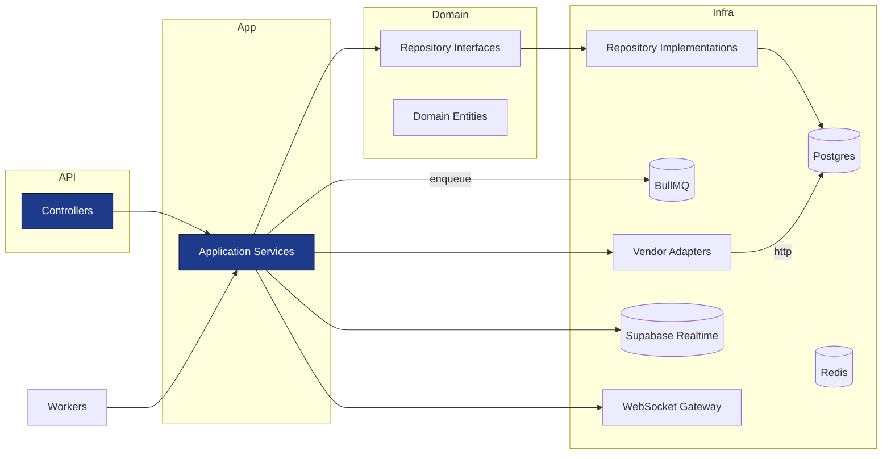

# NestJS Backend Structure — CallHealth Ambulance Integration

This document describes the recommended project layout, module structure, DTOs, repository interfaces, and dependency flow for the NestJS backend. It follows Clean Architecture principles (separation of concerns, dependency inversion) and uses dependency injection, DTOs, repositories, service layer, and workers.

---

## High-level goals
- Keep domain logic framework-agnostic in `domain/` where possible.
- Expose thin controllers that call application services.
- Have repository interfaces in domain layer and infrastructure implementations behind DI tokens.
- Use DTOs and class-validator in presentation layer.
- Use BullMQ for background jobs and Redis for locks/dedup.
- Provide WebSocket gateway and Supabase sync for realtime.

---

## Top-level folders

- `src/`
  - `main.ts` — bootstrap
  - `app.module.ts`
  - `config/` — configuration loaders
  - `common/` — shared guards, interceptors, filters, pipes, decorators
  - `domain/` — domain entities, value objects, repository interfaces
  - `modules/` — feature modules (detailed below)
  - `infrastructure/` — DB, Redis, Bull, HTTP clients, secret manager
  - `workers/` — BullMQ workers and background jobs
  - `gateway/` — WebSocket gateways
  - `test/` — integration and contract tests

---

## Feature modules (pattern)
Each module follows this internal structure:

modules/<feature>/
- `presentation/` (controllers, route DTOs)
- `application/` (services/use-cases, application DTOs)
- `domain/` (entities, value objects, repository interfaces)
- `infrastructure/` (repo implementations, mappers, providers)
- `<feature>.module.ts`

Key modules:
- `auth` — authentication, JWT, Passport strategies
- `ambulance-requests` — request intake, orchestrator
- `vendor-integration` — `VendorManager`, adapters registry
- `tracking` — tracking ingestion, normalization
- `notifications` — channel routing and templates
- `realtime` — WebSocket gateway and Supabase sync
- `shared` / `utils` modules for common providers

---

## Example: `ambulance-requests` module

modules/ambulance-requests/
- presentation/
  - `requests.controller.ts` (receives HTTP, validates DTOs)
  - `dtos/create-request.dto.ts` (class-validator definitions)
- application/
  - `request-orchestrator.service.ts` (orchestrates create -> vendor manager)
  - `request-query.service.ts` (read-optimized queries)
- domain/
  - `entities/ambulance-request.entity.ts`
  - `repositories/request.repository.ts` (interface)
- infrastructure/
  - `repositories/request.repository.impl.ts` (TypeORM/Prisma)
  - `mappers/request-mapper.ts`
- `ambulance-requests.module.ts` (binds interface tokens to implementations)

DI pattern:
- Controller -> inject Application Service
- Application Service -> inject Repository interface token, VendorManager, BullService, NotificationService
- Repository Impl -> inject DB client provider from `infrastructure/database`

---

## DTOs and Validation
- Presentation DTOs use `class-validator`/`class-transformer`.
- Application DTOs (in `application/dto/`) represent canonical shapes used across services.
- Example DTO names: `CreateRequestDto`, `CancelRequestDto`, `TrackingSnapshotDto`, `VendorBookingDto`.

---

## Repository interfaces (examples)
Place under `modules/*/domain/repositories`.

interface `RequestRepository` {
  create(request: AmbulanceRequest): Promise<AmbulanceRequest>
  findById(requestId: UUID): Promise<AmbulanceRequest | null>
  updateStatus(requestId: UUID, expectedVersion: number, status: RequestStatus): Promise<boolean>
  findPendingForReconcile(regionCode: string, olderThan: Date): Promise<AmbulanceRequest[]>
}

Implementations in `infrastructure` use ORM/DB-specific clients and are bound in the module providers.

---

## Workers and Queues
- Define named queues in `infrastructure/bull/queues.ts`:
  - `dispatch.command`
  - `vendor.callback.process`
  - `tracking.reconcile`
  - `notification.fanout`
- Enqueue from application services using a `BullService` wrapper.
- Workers in `workers/` call application services rather than low-level infra to keep business logic centralized.

---

## Realtime
- `gateway/websocket.gateway.ts` handles subscription rooms: `request:{id}`, `region:{code}`.
- `realtime/realtime-publisher.service.ts` provides a single API to broadcast events to WebSocket and Supabase.

---

## Infrastructure providers
Centralized providers exposed for DI:
- `DATABASE_CLIENT` (TypeORM/Prisma)
- `REDIS_CLIENT`
- `BULLMQ_QUEUE_<name>`
- `HTTP_CLIENT_FACTORY` (vendor clients with timeouts/retries)
- `SECRET_MANAGER`

---

## Dependency Flow (Mermaid)

---

## Module interaction examples
- Request flow: Controller -> RequestOrchestratorService -> RequestRepository + Bull -> Worker -> VendorManager -> Adapter -> RequestRepository update -> RealtimePublisher
- Tracking flow: Vendor webhook -> VendorWebhookController -> VendorAdapter verifies -> TrackingIngestService -> TrackingRepository -> RealtimePublisher

---

## Naming conventions and best practices
- Files: `kebab-case.ts` for modules and controllers, `camelCase` for variables, `PascalCase` for classes.
- Avoid mixing domain logic into controllers or infra.
- Keep modules small and cohesive; prefer more modules than fewer gigantic ones.

---

## Next steps (suggested)
- Scaffold the repository skeleton and provider tokens.
- Create empty DTO, entity, and repository interface files as placeholders.
- Add ESLint, Prettier, and a basic Docker Compose for local Postgres/Redis.

File: `nestjs-backend-structure.md` created.
